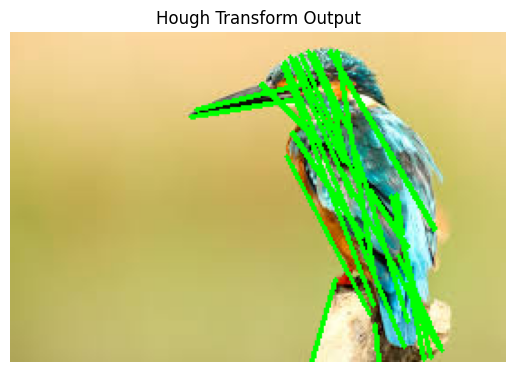

# Hough-Transform
## Aim:
To write a Python program to detect the lines using Hough Transform.

## Software Required:
Anaconda - Python 3.7

## Algorithm:

### Step 1:

Import all the necessary modules for the program.

### Step 2:

Load a image using imread() from cv2 module.

### Step 3:

Convert the image to grayscale.

### Step 4:

Using Canny operator from cv2,detect the edges of the image.

### Step 5:

Using the HoughLinesP(),detect line co-ordinates for every points in the images.Using For loop,draw the lines on the found co-ordinates.Display the image.

# OUTPUT:

# Result:

Thus the python program to detect the lines using Hough Transform was successfully completed.
